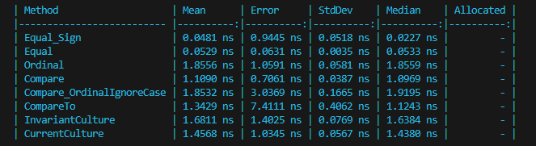

# MY BENCHMARKS


```shell
dotnet run --configuration Release -- --filter *
```
<br/>


## Run a specific class

## Run Sorters
```
dotnet run -- --filter *SortingBenchmark*
```


<br/>


## Run Retrieve Single Data
```
dotnet run --configuration Release -- --filter *RetreivingSingleData*
```

## Results


<br/>

## Run String Comparisons

```
dotnet run --configuration Release -- --filter *StringComparisons*
```




<br/>

## Run When handling string cases

```
dotnet run --configuration Release -- --filter *WhenDoingCases*
```

## Results


<br/>

## Run Filtering Lists

```
dotnet run --configuration Release -- --filter *FliteringList*
```

## Results


<br/>
